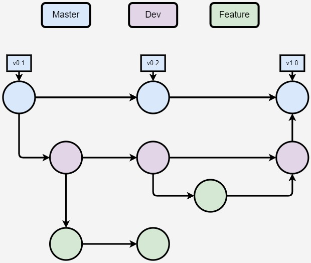
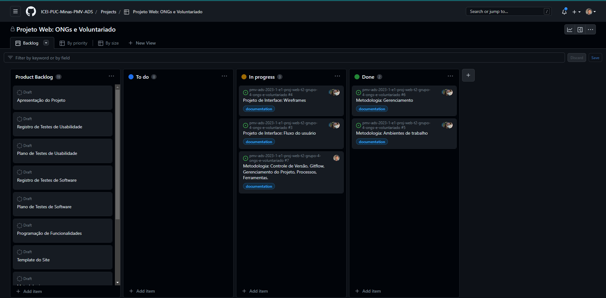

# Metodologia

Pré-requisitos: <a href="2-Especificação do Projeto.md"> Documentação de Especificação</a>

Nesta seção apresentamos as ferramentas utilizadas para a produção e gestão do projeto.

## Controle de Versão

A ferramenta de controle de versão adotada no projeto foi o
[Git](https://git-scm.com/), e o [Github](https://github.com)
foi utilizado para hospedagem do repositório.

## Relação de Ambientes de Trabalho

Na tabela a seguir temos a relação dos ambientes de trabalho com suas respectivas plataformas e links de acesso. Cada ambiente foi pensado com o objetivo de melhorar a qualidade da produtividade dos desenvolvedores.

|**Ambiente**|**Plataforma**|**Link de acesso**|
|:---:|:---:|:---:|
|Repositório de código fonte|GitHub|[Github](https://github.com/ICEI-PUC-Minas-PMV-ADS/pmv-ads-2023-1-e1-proj-web-t2-grupo-4-ongs-e-voluntariado)|
|Documentos do projeto|GitHub|[Github](https://github.com/ICEI-PUC-Minas-PMV-ADS/pmv-ads-2023-1-e1-proj-web-t2-grupo-4-ongs-e-voluntariado/tree/main/docs)|
|Projeto de Interface e Wireframes |Figma |[Figma](https://www.figma.com/file/A3Dj8AcW4lB0oU7vLSJ7K0/Ongs-Wireframes?node-id=0-1&t=2Z6pRI3oNIYHJP6a-0)|
|Gerenciamento do Projeto |GitHub|[Github](https://github.com/orgs/ICEI-PUC-Minas-PMV-ADS/projects/400) |

Quanto à gerência de issues, o projeto adota a seguinte convenção para
etiquetas:

- `documentation`: melhorias ou acréscimos à documentação
- `bug`: uma funcionalidade encontra-se com problemas
- `enhancement`: uma funcionalidade precisa ser melhorada
- `feature`: uma nova funcionalidade precisa ser introduzida

<!-- > **Links Úteis**:
> - [Tutorial GitHub](https://guides.github.com/activities/hello-world/)
> - [Git e Github](https://www.youtube.com/playlist?list=PLHz_AreHm4dm7ZULPAmadvNhH6vk9oNZA)
>  - [Comparando fluxos de trabalho](https://www.atlassian.com/br/git/tutorials/comparing-workflows)
> - [Understanding the GitHub flow](https://guides.github.com/introduction/flow/)
> - [The gitflow workflow - in less than 5 mins](https://www.youtube.com/watch?v=1SXpE08hvGs) -->

## Gerenciamento de Projeto

### Divisão de Papéis

**Scrum Master:** Ana Beatriz  
**Product Owner:** Ademir Colares  
**Equipe de Desenvolvimento:** Raul Janon, Jefferson Freitas  
**Equipe de Design:** Thiago Jesus  
**Equipe de Testes:** Leandro Pereira

<!-- > **Links Úteis**:
> - [11 Passos Essenciais para Implantar Scrum no seu 
> Projeto](https://mindmaster.com.br/scrum-11-passos/)
> - [Scrum em 9 minutos](https://www.youtube.com/watch?v=XfvQWnRgxG0) -->

### Processo

Aqui é onde armazenamos nossas tarefas baseados no Scrum.

 
<!-- > **Links Úteis**:
> - [Project management, made simple](https://github.com/features/project-management/)
> - [Sobre quadros de projeto](https://docs.github.com/pt/github/managing-your-work-on-github/about-project-boards)
> - [Como criar Backlogs no Github](https://www.youtube.com/watch?v=RXEy6CFu9Hk)
> - [Tutorial Slack](https://slack.com/intl/en-br/) -->

### Ferramentas

As ferramentas empregadas no projeto são:

- **Visual Studio Code:** Utilizado para criação de códigos, implementação de imagens e o terminal dele trabalhando junto ao Git e GitHub.
- **Draw.io:** Utilizado para fazer o GitFlow. Porque ele é de fácil compreensão.
- **Teams:** Usado para encontros com tutor do ensino para sanar dúvidas e para apresentação das atividades.
- **Discord:** Para os integrandes se comunicarem sobre o projeto.
- **Figma:** Ferramenta de desenho de tela para compor como será os exemplos do site.
